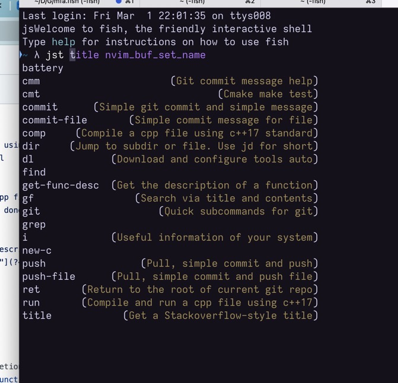

## Usage

- Step 1: `git clone git@github.com:julyfun/jst.fish.git`
- Step 2: In your `~/.config/fish/config.fish`, add:

```
source <path_to_repo>/jst.fish
```

- Step 3 (still under internal test): link your mfa server

```
mfa init # and make sure server does this
ssh-copy-id $MFA_USER_HOST
```

- Now, you can use commands including:

| Command       | Parameter (Example)                                    | Result                                                       |
| ------------- | ------------------------------------------------------ | ------------------------------------------------------------ |
| `mfa upa`     | `mfa upa https://github.com/wangwc18/mygoFlaskProject` | Upload this address to Mfans server                          |
| `jd`          | `jd python`                                            | Jump to subdirectory with similar name to `python`           |
| `ja`          | `ja fix typo`                                          | Commit all changes with message `fix typo`                   |
| `jp`          | `jp update README.md`                                  | Commit all changes and push with message `update README.md`  |
| `jst cmm`     |                                                        | Show git commit message help                                 |
| `jst dl`      | `jst dl autojump`                                      | Download and configure `autojump` automatically              |
| `jst gf`      | `jst gf iostream`                                      | Search `iostream` in current directory by title and contents |
| `jst run`     | `jst run 1.cpp`                                        | Compile `1.cpp` with c++17 standard and run it               |
| `jst ret`     |                                                        | Return to the root folder of current repo                    |
| `jst git ig`  |                                                        | Generate a useful default `.gitignore` file                  |
| `jst git log` |                                                        | Show beautiful commit history of current repo                |
| `jst git o`   | `jst git o README.md`                                  | Open the github page of `README.md` in current folder        |



## Introduction

这是一个神奇的快捷工具箱，只为 fish shell 提供，因为 fish shell 的语法舒服。

## Extensions

Some `jst` command would require these:

### Linux

```
sudo apt install xclip
```

### Macos

```
no
```

## Todo

- [ ] mfa upa 时自动 mfa init
- [x] jst 系列命令整合
- [ ] 用 toml 自定义短命令
- [ ] 建立 jst dl 下载和配置的清单。需要考虑用什么形式实现。
- [x] jst title 支持汉字
- [ ] 统计为您节省多少时间，以及创作这个命令花了多久

## Principles

- 避免敏感操作，如 `apt upgrade`
